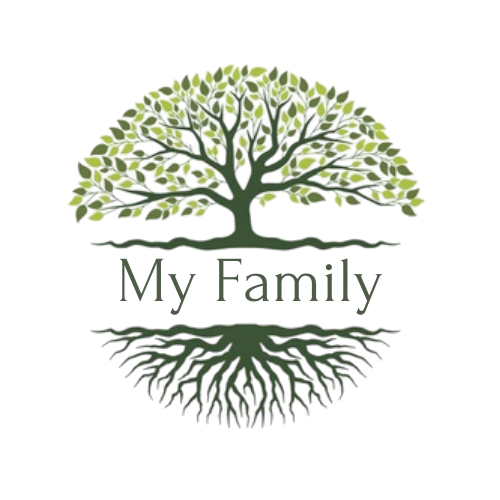

## About My Family

My Family is a web application for exploring family history, and building a family tree

- Finds matching profiles in family trees, enabling users to discover new ancestors and relatives, and connect with other users.
- Automatic matches between people and historical records.
- MUnique technology that allows adding a whole new branch to the family tree in one click.
- Search engine for exploring billions of historical records.
- Automatically extends the paper trail from a single historical record to other related records and family tree connections.
- Translates names found in historical records and family trees from one language into another, to facilitate matches between names in different languages.
- Enables users to easily find others who are looking for the same ancestors or relatives, and get in touch with them.

## Contributing

Thank you for considering contributing to this work!.

## Security Vulnerabilities

If you discover a security vulnerability within our application, please send an e-mail to us via [myfamilyteam@gmail.com](mailto:myfamilyteam@gmail.com). All security vulnerabilities will be promptly addressed.

## License

The Laravel application is open-sourced software.

## Credit

The template is designed by [Colorlib](https://colorlib.com/)
